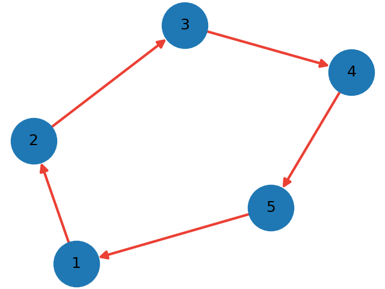
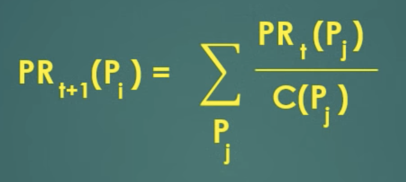

# simplified-page-rank
Autorzy: Hubert Jankowski, Michał Najborowski, Radosław Leszkiewicz

## Opis zadania
**Uproszczony algorytm Page Rank**. Implementacja iteracyjnej metody obliczania wartości własnych macierzy. Wykorzystanie do uproszczonej implementacji algorytmu Page Rank. Dyskusja zachowania przy różnych skalach grafów relacji.

## Opis algorytmu
PageRank jest algorytmem niegdyś używanym przez wyszukiwarkę Google do pozycjonowania stron internetowych w wynikach silnika wyszukiwarki. PageRank został nazwany po nazwisku twórcy, Larrym Page’u, jednego z założycieli firmy Google. Algorytm jest sposobem na ocenianie wartości stron internetowych. Właściwy algorytm nigdy nie został ujawniony, jedynie jego uproszczona forma.

Wynikiem algorytmu jest lista prawdopodobieństw, z którymi osoba losowo klikająca w linki ostatecznie znajdzie się na danej stronie. PageRank może zostać wyliczony dla kolekcji dokumentów dowolnej wielkości. Obliczenie wyniku wymaga kilku iteracji, w których to za pomocą iteracyjnego obliczania wartości własnych macierzy, algorytm dostosowuje oceny tak, aby odzwierciedlały prawdziwe wartości.

## Przykład
Jako przykład przeprowadzona zostanie analiza skierowanego grafu relacji przedstawionego na poniższym obrazku: 

Wierzchołek grafu oznacza stronę internetową, natomiast skierowana krawędź grafu (v, u) oznacza relację, gdzie v - strona źródłowa zawierająca odnośnik, u - strona, do której prowadzi odnośnik ze strony źródłowej.

Przyjmuje się, że PageRank każdej strony internetowej w zerowej iteracji wynosi 1/liczba_wszystkich_stron. PageRank w każdej kolejnej iteracji obliczany jest wg. wzoru:

gdzie PRt(Px) oznacza PageRank w iteracji t strony Px; C(Px) oznacza liczbę wszystkich wychodzących linków od strony Px.

W analizowanym przykładzie można zauważyć cykl pojedynczych połączeń, w wyniku czego PageRank każdej ze stron będzie wynosić 0.2 już od pierwszej iteracji. 
